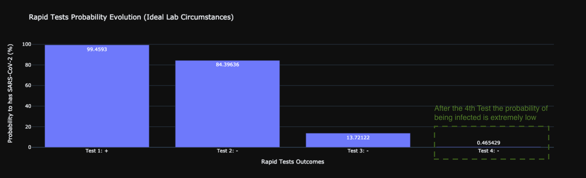

The above exercise has been done to highlight the importance of test sampling and how Bayes probabilities go against our intuition. \
***NOTE:*** *The following analysis is focused on SARS-CoV-2 (COVID-19) Rapid Tests / Antigen Tests but the concept and the maths behind that can easily generallized in other tests.*

# Questions
* What is the probability someone has SARS-CoV-2 (COVID-19) if he has one positive Rapid test and then only negatives?
* If someone do a single test with negative result for SARS-CoV-2 (COVID-19), what is the probability of being infected?
* What other parameters is affect test results?

## Real Life Scenario :syringe:
Someone (we can call him Jake :man:), runs the following sequential Rapid Tests in a Point-of-Care:
* Test 1: Positive (+)
* Test 2: Negative (-)
* Test 3: Negative (-)
* Test 4: Negative (-)

**Assumptions**
* All the tests take care in the same time.
* All the tests are from the same brand
    

Now :man: is confused :confused:, he don't know if he is infected or not, have to stay home or not..
But, :man: has basical statical knowledge and he can estimate the probability of being infected :smiling_imp:

:man: started his analysis by ground the initial probabilities without giving too much attention on them because
he focused on metrics relationships and not so much on the actual initial values.

---

### Rapid Test Performance Metrics
Let's assume the the Rapid test is the [VivaDiagTM Pro SARSCoV-2 Ag Rapid Test](https://www.mmbiotech.it/en/prodotto/vivadiag-pro-sars-cov-2-ag-rapid-test-tampone-antigene-covid-rapido-confezione-da-25-tamponi-rapidi/).
* Specificity = 99.99%
* Sensitivity = 97.06%

**Test Parameters: SARS-CoV-2 Ag**
* Test Principle: Immunochromatorgraphy
* Sample Type: Nasal swab / Nasopharyngeal swab / oropharyngeal swab
* Sample Volume: 60 μl
* Test Time: 15 min
* Operation Temperature: 15-30°C
* Storage Temperature: 2-30°C
* Shelf Life: 24 months

---

## Population Prevelence
Let's assume that the target country is Greece.
  * Daily Active Cases = 200.000 ([Source](https://www.worldometers.info/coronavirus/country/greece/))
  * Greece Population = 10.72M

The population prevelance is calculated with the following formula:
```
    Covid prevelence = Daily Active Cases / Greece Population = 200.000/ 10.720.000 = 0.0186 or 1.86%
```
---

## Propability estimation maths

### Notations

**---- Hypothesis ----**

**Ho**: Disease Free \
**H1**: Have Disease (SARS-CoV-2)

**---- Outcomes ----**

**+** : Positive test outcome \
**-** : Negative test outcome

---

### 1st Test: Estimate the probability of has SARS-CoV-2 (H1) given a positive test (+)
```
P(H1 | +) = P(+ | H1) x P(H1) / P(+) (Bayes Rule)
```

P(H1)     = 0.0186 \
P(Ho)     = 1 - P(H1) \
P(+ | H1) = Sensitivity \
P(+ | Ho) = 1-Specificity \
P(+)      = TruePositive + FalsePositive = P(+ | H1) x P(H1) + P(+ | Ho) x P(Ho)

Propability: **P(H1 | +) = 99.45%**

--- 

### 2nd Test: Estimate the probability of has SARS-CoV-2 (H1) given a negative test (-)
```
P(H1 | -) = P(- | H1) x P(H1) / P(-) (Bayes Rule)
```

P(H1)     = 0.645 (Previous test probability) \
P(Ho)     = 1 - P(H1) \
P(- | H1) = 1 - Sensitivity \
P(- | Ho) = 1 - P(+ | Ho) = 1 - (1-Specificity) = Specificity \
P(-)      = TrueNegative + FalseNegative = P(- | Ho) x P(Ho) + P(- | H1) x P(H1)

Propability: **P(H1 | -) = 84.39%**

etc ...

Finally, we have the following probabilities for the four sequential tests:




:man: xmm... the probability for having SARS-CoV-2 looks very low after 3 sequential negative tests! Yeah no infection!! \
YES this will be the outcome if the experiments have take care by experts in a laboratory environment.

BUT in a Point-of-Care location (e.g. pharmacies, doctor offices, homes,  etc.) the probability of incorrect sampling is high :unamused:.

---
## Re-estimate the probabilities in a Point-of-Care

In a Point of Care, you or the person who will do the sampling of the mucus and cells will not be so finicky as a medical professional in lab. \
This will play significant role in SARS-CoV-2 (COVID-19) catching. In other words, the cases of not caching the virus will be higher (False Negatives).

In our case, the metric which will be affected is the test `Sensitivity`. \
Sensitivity, is the metric which describes what proportion of the actual positives is correctly identified. \
(`Sensitivity = TP / (TP + FN)`, where TP: True Positive, FN: False Negative)

Let's plot the correlation between the Sensitivity and the probability of actually having SARS-CoV-2.
Also add a cut of point (vertical dash line) with the estimated `Point-of-Care Sensitivity = 0.789`, [source](https://www.healthline.com/health/how-accurate-are-rapid-covid-tests).

Finally, we re-estimate the probabilities of the four sequential tests by using the `Point-of-Care Sensitivity = 0.789` in our formulas:


Now the results are not so clear with the probability of infected from COVID-19 being higher!!

The "accuracy" of a test is higly correlated with the sampling circumstances.


In the first case (Green), we conclude that the first positive test was not sufficient to conclude that the subject was infected ( **P(H1 | -) = 0.46%**) \
In the second case (Red), the results are significant different and conclude that the subject is possible to be infected ( **P(H1 | -) = 58%**)

It's worth to mention that the `Point-of-Care Sensitivity = 0.789` could be lower in specific occuations and the probability of being infected much higher

---
### Let's test something different.. 
How likely is someone has SARS-CoV-2 with only negative outcomes?


:flushed: What?? **0.39%** from the first test? Why so low?

## Conclusions

Without a positive test the probability of being infected is extremely low. The reason for that is the "magic" behind Bayes theorem.\
Without an initial positive test the prior probability is the population prevelence which is quite low (1.86%). On the other hand,  \
with a first positive test the probability of having the desease is quite high (>99%) and the subject needs five or more sequential \
negative tests to be sure for a negative outcome.

In summary, the probability of being infected it depends on:
* The population infection
* Test performance metrics (Sensitivity, Specificity)
* Test location (Laboratory or Point-of-Care) which affects the Test perfomance metrics (Sensitivity, Specificity)


All the knowledge in few bullets:
* A positive test is significant and needs many tests to "cancel" the positive result.
* If the desease has a low population infection and the first test is negative its probable negative.
* If the infection of the population is high, then more negative tests needed to prove the no infection.
* The location of the test (Laboratory or Point-of-Care) can significally affect the results.

**NOTE: The code and the plots created from the Multiple Rapid Tests Probability Estimation.ipynb**

:beers: Cheers!
